# 编译项目2报告

[TOC]

## 软件环境

* 平台：Windows Subsystem of Linux(Ubuntu 18.04)
* 编译器：g++ 7.4.0
* 语法分析器：flex 2.6.4, bison 3.4
* 其他工具：Make 4.1
* 编程语言：C++17

## 项目结构

```c
.
├── Makefile
├── _pcat_parser    // 生成的可执行文件
├── dep             // 包含各个C++源文件的依赖信息的文件夹
├── include         // 头文件目录
│   ├── ast         // 抽象语法树的类型定义
│   │   ├── declaration.hh
│   │   ├── defs.hh       
│   │   ├── expression.hh 
│   │   ├── root.hh       
│   │   ├── statement.hh  
│   │   └── type.hh
│   ├── driver      // 语法树与语法分析器的接口
│   │   ├── driver.hh
│   │   └── keywords.hh
│   ├── location.hh // bison生成的头文件，包含与位置相关的类
│   ├── parser.hh   // bison生成的头文件，语法分析器的接口
│   └── utils.hh    // 用于输出空格的工具
├── main.cc         // 程序入口
├── obj
├── parser_src      // 词法分析与语法分析文件
│   ├── parser.yy
│   └── scanner.l
├── result					// tests文件夹中文件的语法分析的结果
├── src             // C++源文件
│   ├── declaration.cc
│   ├── driver.cc
│   ├── expression.cc
│   ├── parser.cc
│   ├── scanner.cc
│   ├── statement.cc
│   └── type.cc
└── tests						// 包含用于测试的源文件
```

## 使用方法

进入项目文件夹，在shell中输入`make`即可构建目标程序。构建成功后使用`make run FILE=filename`（其中`filename`不包括路径和后缀名），程序会去寻找文件`tests/filename.pcat`并对其进行语法分析

`make`命令：
* `make`或`make build`：构建目标程序
* `make run FILE=filename`：对文件`tests/filename.pcat`进行语法分析

## 一个辅助工具

由于输出语法树时需要输出大量空格，为了方便，在`include/utils.hh`中定义了类`blank`用于输出空格：

```c++
class blank {
    int _n;
public:
    blank(int n) : _n(n) {
        if (_n < 0) {
            throw std::range_error(
              "number of blank chars can't be negative"
            );
        }
    }

    friend std::ostream& operator<<(std::ostream& os, const blank& b) {
        if (b._n > 0) {
            os << std::setw(b._n) << ' ';
        }
        return os;
    }
};
```

这样只需要用`os << blank(n)`就可以方便地输出$n$个空格

## 抽象语法树

* 抽象语法树(AST)类型定义的头文件在文件夹`include/ast`中，相应的实现文件在文件夹`src`中
* AST使用继承的方式实现层级结构
* 为了避免手动管理内存的麻烦，使用了`C++11`提供的智能指针`shared_ptr`自动管理内存，并定义了`sptr`作为`shared_ptr`的简称：
    ```c++
    template<typename T>
    using sptr = std::shared_ptr<T>;
    ```

下面以继承层次为单位介绍AST的具体内容：

### 基本接口

继承示意图如下：

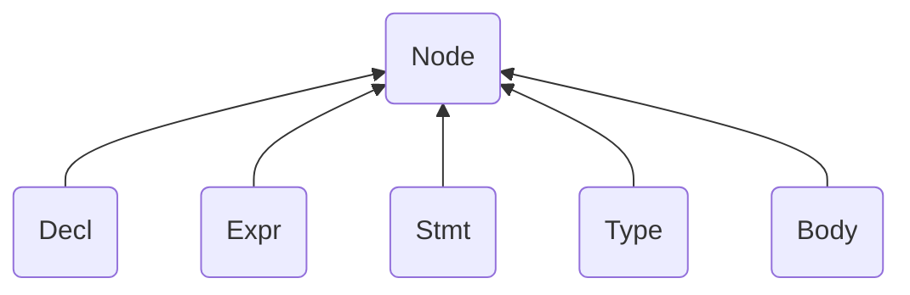

其中类`Node`, `Decl`, `Stmt`, `Expr`, `Type`均定义在`include/ast/defs.hh`中，类`Body`定义在`include/ast/body.hh`中

1. 类`Node`：整个AST的基类
    * 变量`loc_type _loc`：表示该语法树节点在源文件中对应的位置，其中`loc_type`是bison生成的`yy::location`的别名（`yy::location`见[C++位置接口](#C++位置接口)）：
        ```c++
        using loc_type = yy::location;
        ```
    * 函数`void setLocation(const loc_type& loc)`：设置位置，将`_loc`的值设为`loc`
    * 函数`void printLoc(std::ostream& os) const`：输出位置
    * 函数`virtual void print(std::ostream& os, int level) const = 0`：输出该节点的内容
2. 类`Expr`：所有`表达式`类的基类
3. 类`Decl`：所有`声明`类的基类
4. 类`Stmt`：所有`语句`类的基类
5. 类`Type`：所有`类型`类的基类
6. 类`Body`：表示程序或函数的主体部分
    * 变量`_declList`：包含范围内所有的声明
    * 变量`_stmtList`：包含范围内所有的语句

### 类型部分

继承示意图如下：

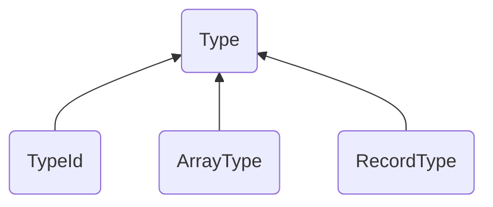

除了`Type`定义在`include/ast/defs.hh`中以外，其他类均定义在`include/ast/type.hh`中

1. 类`TypeId`：表示只用一个标识符定义的类型

    * 变量`sptr<Identifier> _id`：表示该类型的标识符

2. 类`ArrayType`：表示数组类型

    * 变量`sptr<Type> _baseType`：数组的基类型

3. 类`RecordType`：表示`Record`
    * 类型`RecordComponent`：`Record`中的每个字段的类型，包括标识符和相应的类型

      ```c++
      using RecordComponent = std::pair<sptr<Identifier>, sptr<Type>>;
      ```

    * 变量`std::vector<RecordComponent> _component`：`Record`中的所有字段的列表


### 声明部分

继承示意图如下：

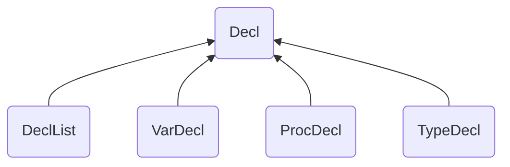

除了`Decl`定义在`include/ast/defs.hh`中以外，其他类均定义在`include/ast/declaration.hh`中

1. 类`DeclList`：用于将同一层次的声明整合在一起

    * 变量`std::vector<sptr<Decl>> _decls`：声明组成的的列表
    * 函数`void addDecl(sptr<Decl> decl)`：向`_decls`中添加一条声明
    * 函数`void addDeclList(sptr<DeclList> decls)`：将`decls`中的声明全部添加到
      `this->_decls`的末尾

2. 类`VarDecl`：变量声明
    * 变量`std::vector<sptr<Identifier>> _ids`：这条声明中包含的标识符
    * 变量`sptr<Type> _type`：声明的标识符的类型（可能为空）
    * 变量`sptr<Expr> _initVal`：声明的初始值

3. 类`ProcDecl`：函数声明
    * 类型`FPSection`：语法分析时保存参及其类型

      ```c++
      using FPSection = std::pair<
        std::vector<sptr<Identifier>>, sptr<Type>
    	>;
      ```

    * 变量`sptr<Identifier> _name`：表示函数名的标识符

    * 变量`std::vector<std::variant<sptr<Identifier>, sptr<Type>>> _params`：参数列表

      这里由于参数列表中的标识符可能是表示参数的标识符，也可能是表示类型的标识符，所以为了方便，使用了C++17提供的`std::variant`类，它相当于一个类型安全的`union`，并且不需要程序员额外记录其中保存的值的类型

    * 变量`sptr<Type> _retType`：返回值的类型

    * 变量`sptr<Body> _body`：函数体
    
4. 类`TypeDecl`：类型声明
    * 变量`sptr<Identifier> _id`：表示类型名的标识符
    * 变量`sptr<Type> _type`：声明的类型

### 表达式部分

继承示意图如下：

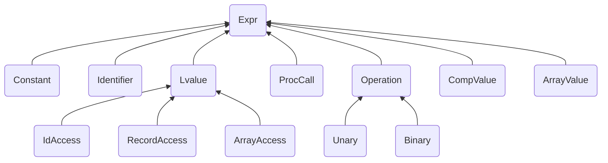

 除了`Expr`定义在`include/ast/defs.hh`中以外，其他类均定义在`include/ast/expression.hh`中 

1. 类`Constant`：表示整数、实数和字符串等“字面量”

    * 枚举`enum ConstType`：用于标识类型（`INTEGER`, `REAL`或`STRING`）
    * 变量`std::string _val`：包含对应的值
    * 变量`ConstType _type`：值的类型

2. 类`Identifier`：表示标识符
    * 变量`std::string _name`：标识符的名字
    * 函数`const std::string& getName() const`：获取标识符的名字

3. 类`Lvalue`：表示左值的类的基类

4. 类`IdAccess`：表示只含一个标识符的左值

    * 变量`sptr<Identifier> _id`：对应的标识符

5. 类`RecordAccess`：表示访问`Record`的左值
    * 变量`sptr<Lvalue> _target`：表示要访问的`Record`
    * 变量`sptr<Expr> _idx`：表示要访问的成员的索引

6. 类`ArrayAccess`：表示范围数组的左值

    * 变量`sptr<Lvalue> _target`：表示要访问的数组
    * 变量(继承自`Lvalue`)`sptr<Identifier> _id`：表示要访问的`Record`中的成员

7. 类`Operation`：运算表达式的基类

    * 枚举`enum Operator`：用于区别运算符的类型
    * 静态变量`static const std::string opName[]`：运算符的名字，与`Operator`枚举相对应，便于输出表达式
    * 变量`Operator _op`：保存运算符的类型

8. 类`Unary`：表示一元运算符的表达式

    * 变量`sptr<Expr> _expr`：参与运算的表达式

9. 类`Binary`：表示二元运算符的表达式

    * 变量`sptr<Expr> _expr1, _expr2`：参与运算的表达式

10. 类`ProcCall`：函数调用表达式
    * 变量`sptr<Identifier> _name`：函数名
    * 变量`std::vector<sptr<Expr>> _args`：参数列表

11. 类`CompValue`：复合类型的值，用于给`Record`赋值
     * 类型`Component`：`<标识符，值>`对，用于记录`Record`的每个成员及对应的值

       ```c++
       using Component = std::pair<sptr<Identifier>, sptr<Expr>>;
       ```

     * 变量`sptr<Identifier> _id`：`Record`的类型

     * 变量`std::vector<Component> _values`：要赋的值

12. 类`ArrayValue`：表示数组的值，用于给数组赋值

     * 类型`ArrayComp`：用于记录数组的每一项的值的类型

       ```c++
       using ArrayComp = std::pair<sptr<Expr>, sptr<Expr>>;
       ```

     * 变量`sptr<Identifier> _id`：表示要创建的数组的类型

     * 变量`std::vector<ArrayComp> _values`：要赋的值

### 语句部分

继承示意图如下：

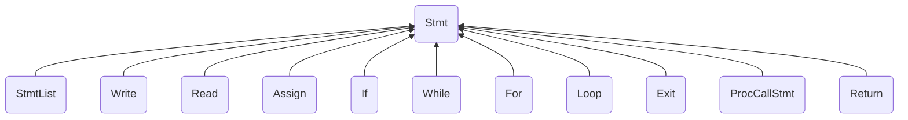

 除了`Stmt`定义在`include/ast/defs.hh`中以外，其他类均定义在`include/ast/statement.hh`中 

1. 类`StmtList`：用于将同一层次的语句整合在一起

    * 变量`std::vector<sptr<Stmt>> _stmts`：语句组成的列表
    * 函数`void addStmt(sptr<Stmt> stmt)`：向`_stmt`中添加一条语句

2. 类`Write`：`WRITE`语句
    * 类型`WriteExpr`：`WRITE`的参数的类型，是`sptr<Expr>`或`sptr<Constant>`

      ```c++
      using WriteExpr = std::variant<sptr<Expr>, sptr<Constant>>;
      ```

    * 变量`std::vector<WriteExpr> _writeExprs`：保存`WRITE`的全部参数

3. 类`Read`：`READ`语句

    * 变量`std::vector<sptr<Lvalue>> _args`：保存`READ`的参数

4. 类`Assign`：赋值语句
    * 变量`sptr<Lvalue> _lvalue`：被赋值的左值
    * 变量`sptr<Expr> _expr`：表示要赋的值的表达式

5. 类`If`：`IF`语句
    * 类型`IfComponent`：表示`IF`语句的条件和语句体的类型，由表示条件的`Expr`和表示语句体的`StmtList`组成

      ```c++
      using IfComponent = std::pair<sptr<Expr>, sptr<StmtList>>;
      ```

    * 变量`IfComponent _if`：`IF`部分

    * 变量`std::vector<IfComponent> _elsif`：所有的`ELSIF`部分

    * 变量`sptr<StmtList> _else`：`ELSE`部分

6. 类`While`：`WHILE`语句
    * 变量`sptr<Expr> _condition`：表示循环条件的表达式
    * 变量`sptr<StmtList> _stmts`：语句体

7. 类`For`：`FOR`语句
    * 变量`sptr<Identifier> _id`：循环变量
    * 变量`sptr<Expr> _expr1, _expr2, _expr3`：起始值、终止值和步长
    * 变量`sptr<StmtList> _stmts`：语句体

8. 类`Loop`：`LOOP`语句

    * 变量`sptr<StmtList> _stmts`：语句体

9. 类`Exit`：`EXIT`语句

10. 类`ProcCallStmt`：函数调用语句

   * 变量`sptr<ProcCall> _procedure`：对应的函数调用表达式

11. 类`Return`：`RETURN`语句

     * 变量`sptr<Expr> _expr`：返回值

## bison的使用

项目使用了bison 3.4，主要参考了[这篇文档](https://www.gnu.org/software/bison/manual/bison.html)

### 文件开头的一些声明

```c++
%skeleton "lalr1.cc" // 指定分析器
%require "3.4"       // 版本声明
%defines             // 生成包含终结符名、终结符类型等接口的头文件
%defines "include/parser.hh" // 指定生成的分析器接口头文件
```

### bison的C++接口

bison生成的所有代码均默认放在名字空间`yy`中，包括一些类型定义、类定义和函数定义

下面的内容全部都定义在类`yy::parser`中
* 类型`semantic_type`：C++语义类型（见[C++语义接口](#C++语义接口)）
* 类型`location_type`：C++位置类型（如果启用位置追踪）（见[C++位置接口](#C++位置接口)）
* 类型`token`：一个结构，其中只包含一个枚举`yytokentype`，用于表示终结符的类型
* 类型`syntax_error`：继承自`std::runtime_error`，用于报告语法错误
* 构造函数`parser(type1 arg1, ...)`：其参数用`%param { type1 arg1, ... }`指定，本程序中的设置是`%param { driver& drv }`
* 函数`int operator()()`和`int parse()`
  调用语法分析器，返回0表示成功，返回1表示存在语法错误，返回2表示内存溢出
* 函数`void error(const location_type& l, const std::string& m)`
  发现语法错误时会调用这个函数，`l`是发生错误的位置（如果不启用位置追踪，则没有这个参数），`m`是错误的信息。发生语法错误后，分析会立刻结束

### C++语义接口

* bison提供了类型`variant`用于表示语义类型（该类型与C++17提供的`std::variant`并不相同），它类似于原来的`union`，但不同的是`variant`类型的变量必须正确地构造、赋值，最终销毁，并受到严格的类型检查
* 要使用`variant`，需要使用`%define api.value.type variant`指定
* 要定义语义类型可以包含的具体类型，使用下面的定义方法：
    ```c++
    // 定义终结符的名字和类型
    %token <int> NUMBER;
    %token <std::string> STRING;

    //定义非终结符的名字和类型
    %type <sptr<Expr>> expression
    %type <sptr<Lvalue>> l_value
    ```
### C++位置接口

要使用bison的位置接口，需要使用`%locations`指定。bison会生成两个类，`position`和`location`。`position`表示一个具体的位置，包括文件名、行号和列号；`location`表示一个位置范围，它包含两个`position`类型的成员，分别是`begin`和`end`。

* 项目中用到的接口：
    * `void position::lines(int height = 1)`：将`position`的行号增加`height`
    * `void position::columns(int width = 1)`：将`position`的列号增加`width`
    * `void location::columns(int width = 1)`：对成员`end`调用`columns(width)`
    * `void location::lines(int height = 1)`：对成员`end`调用`lines(height)`
    * `void location::step()`：将`end`的值赋值给`begin`，即执行`begin = end;`
除此之外，bison还为它们提供了输出函数和比较函数
* 对外界暴露位置接口
使用了`%locations`时，bison会生成头文件`location.hh`，可以通过`%define api.location.file "xxx.hh"`指定产生的头文件的位置和文件名，也可以在调用bison时使用参数`-Dapi.location.file='"xxx.hh"'`，本项目中使用了后者
当更改了默认的行为时，需要使用`%define api.location.include { "xxx.hh" }`指定如何包含该头文件
### 定义终结符

```c++
// TOK_ 会被加入到每个终结符的名字前，即终结符的名字是TOK_EOF...
// 它们会被作为枚举值加入到yy::parser::token::yytokentype中
%define api.token.prefix {TOK_}
// 没有语义值的终结符
%token
  EOF 0 "end of file" // 引号中的字符串用于提供更好的报错信息
  WHILE
  WRITE
  ASSIGN ":="
  PLUS   "+"
;
// 有语义值的终结符
%token <sptr<Identifier>> ID
```

上面写在终结符后面字符串用于提供该终结符的令一种表示方式，例如在上面的声明之后，可以用`":="`引用终结符`ASSIGN`。同时，bison在输出该终结符时也会输出字符串中的内容，这样在语法报错时可以更直观地展示该终结符。

### C++词法分析接口

* bison3.4支持两种从词法分析器获取终结符的方式，一种是返回终结符的类别，而语义值和位置信息通过作为参数的指针获取；另一种是将整个终结符整体返回。显然第二种更加方便，所以我采用了第二种接口。

* 要使用第二种接口，需要同时使用`%define api.value.type variant`和`%define api.token.constructor`

* 使用第二种接口时bison要求`yylex`函数有如下的原型：`parser::symbol_type yylex(type1 arg1, ...)`，用户可以通过定义宏`YY_DECL`给出它的原型。本项目中，此定义在`include/driver/driver.hh`中给出：
    ```c++
    #define YY_DECL yy::parser::symbol_type yylex(driver& drv)

    YY_DECL;
    ```
    
* bison会生成如下的构造终结符的函数：
    ```c++
    symbol_type(int token, const value_type& value,
                const location_type& location)
    symbol_type(int token, const location_type& location)
    symbol_type(int token, const value_type& value)
    symbol_type(int token)
    ```
    其中的`token`来自枚举`yy::parser::token::yytokentype`（见[bison的C++接口](#bison的C++接口)）
    
    但是这种用法并不能在编译时就发现符号类型与语义值的不匹配，而是会在运行时抛出异常
    
* bison还为每一种有名字的终结符提供了命名构造器，这种构造器可以保证在编译时发现错误
    ```c++
    symbol_type make_token(const value_type& value,
                           const location_type& location)
    symbol_type make_token(const location_type& location)
    symbol_type make_token(const value_type& value)
    symbol_type make_token()
    ```
    其中`token`是终结符的名字，`value`是对应的语义值，`location`是终结符的位置
    例如，定义了下列终结符：
    
    ```c++
    %define api.token.prefix {TOK_}
    %token <std::string> IDENTIFIER;
    %token <int> INTEGER;
    %token COLON;
    %token EOF 0;
    ```
    bison会生成：
    ```c++
    symbol_type make_IDENTIFIER(const std::string&, const location_type&);
    symbol_type make_INTEGER(const int&, const location_type&);
    symbol_type make_COLON(const location_type&);
    symbol_type make_EOF(const location_type&);
    ```
    相应的，在词法分析器中的用法是：
    ```c++
    [a-z]+   return yy::parser::make_IDENTIFIER(yytext, loc);
    [0-9]+   return yy::parser::make_INTEGER(stoi(yytext), loc);
    ":"      return yy::parser::make_COLON(loc);
    <<EOF>>  return yy::parser::make_EOF(loc);
    ```
    注意：没有名字的终结符是没有这种构造器的
### C++语法报错接口

bison定义了异常类`yy::parser::syntax_error`，它继承自`std::runtime_error`。一旦发现语法错误，分析程序就会抛出这个异常，并将错误信息和位置放在其中。用户也可以通过这种方式来报告语法错误。这个异常会导致语法分析程序终止，然后被外面的`catch`语句捕获。被捕获后，bison会调用函数`yy::parser::error`报告错误。bison只是声明了这个函数，用户必须提供它的定义。指定`%define parse.trace`和`%define parse.error verbose`时，bison会提供更加详细的错误信息。

本项目中`yy::parser::error`函数的定义是：

```c++
void yy::parser::error(const location_type& l, const std::string& m) {
#define RED "\033[31m"
#define RESET "\033[0m"
  std::cerr << RED << l << ": " << m << RESET << std::endl;
}
```

其中的宏`RED`会使之后输出的文字变成红色，`RESET`会将文字颜色重置，这样就可以提供更明显的错误信息。

### `%code`的用法

`%code`块用于引入C++代码，一般情况下，所有的`%code`块中的代码会被按顺序加入到语法分析器的实现文件（C++源文件）中。但是有时候一些代码在语法分析器的头文件中就会用到，比如引入了其他的头文件等等，此时就需要在`%code`后面加上`requires`，这样块中的代码就会被加入到头文件中。例如，下面这段代码就会被加入到`parser.hh`中：

```c++
%code requires {
  #include "ast/body.hh"
  #include "ast/expression.hh"
  #include "ast/type.hh"
  class driver;
}
```

### 产生式

bison的产生式具有如下形式：

```c++
target:
  rule1 { /* action1 */ }
| rule2 { /* action2 */ }
;
```
其中`action`部分是每次匹配到这个产生式时要执行的代码。对于空产生式，`rule`部分可以为空，但最好用`%empty`显式标出。
在`action`部分，可以通过`$$`引用产生式的目标的语义值，用`$n`引用规则右侧第$n$个符号的语义值(如下面的第1行的例子）。此外，还可以通过符号的名字引用该符号（如下面的第2行的例子）。但是，如果有两个符号的名字相同，这种用法会产生歧义，为了消除歧义，可以在符号后面给符号命名，并用这个新名字引用这个符号（如下面的第3行的例子）。

```c++
exp:         exp       '+' exp        { $$ = $1 + $3; }
exp1:        exp2      '+' exp3       { $exp1 = $exp2 + $exp3; }
exp[result]: exp[left] '+' exp[right] { $result = $left + $right; }
```
可以用同样的方法引用符号的位置值，只需要将第一个`$`换成`@`即可（例如`@$`表示`target`的位置，`@1`表示产生式右侧第一个符号的位置）

### 优先级和结合性

处理运算符表达式时会遇到优先级的问题，bison提供了一种定义运算符优先级的方法：

```c++
%nonassoc  ">" "<" "=" ">=" "<=" "<>";
%left "+" "-" OR;
%left "*" "/" MOD DIV AND;
%right uop NOT;

expression:
  "(" expression ")" 
| "+" expression %prec uop 
| "-" expression %prec uop 
| NOT expression           
| expression "+"  expression 
| expression "-"  expression 
| expression "*"  expression 
| expression "/"  expression 
// ...
;
```
  可以用`%left`、`%right`、`%nonassoc`对终结符定义优先级，同一行的终结符的优先级相同，且都低于下面的终结符的优先级。`%left`表示终结符是左结合的，`%right`表示终结符是右结合的，`%nonassoc`终结符是非结合的（即不允许出现`x op y op z`这种用法）。除了直接对终结符定义优先级，还可以通过定义额外的符号（如上面的`uop`），搭配`%prec`给产生式定义优先级（如上面的第8、9行的产生式中的`%prec uop`），这常见于同一个终结符有不同的用法的情况（如负号和减号）。

## 词法分析器

与语法分析器相比，词法分析器要简单很多，而且它只会生成一个C++源文件，所有词法分析的部分都在这个文件里。

### 引用位置信息

词法分析程序使用参数`drv`中的`loc`成员变量标记当前的位置，为了方便访问，在词法规则部分定义了一个代码块：

```c++
%{
  yy::location& loc = drv.location;
%}
```
  这个代码块会被添加到`yylex`函数的开头，这样，后面就可以用`loc`变量来引用位置信息

### 更新位置信息

`flex`有一个宏`YY_USER_ACTION`，它在每次匹配到一个规则时都会执行，所以可以通过它来定义更新位置的代码：

```c++
# define YY_USER_ACTION  loc.step(); loc.columns(yyleng);
```
这段代码表示每匹配到一个规则，就将当前位置的`begin`设为`end`，然后将`end`的列号增加`yyleng`（见[C++位置接口](#C++位置接口)）。
但是，注释可能是多行的，匹配到注释时不能使用上述默认操作更新位置，所以额外定义了一个函数用于处理：

```c++
void skip_COMMENT(const char* comment, yy::location& loc) {
  int pos = -1;
  int nlines = 0;
  int i = 0;
  // 寻找最后一个'\n'
  while (comment[i]) {
    if (comment[i] == '\n') {
      pos = i;
      nlines++;
    }
    i++;
  }
    
  if (nlines != 0) { // 多行注释
    loc.lines(nlines);
    loc.columns(i - pos);
  }
}
```

### 匹配标识符

所有的标识符（包括关键字）在词法分析时都是一起匹配的，为了在生成终结符时能够区分关键字和普通标识符，在头文件`include/driver/keywords.hh`中定义了变量`keywords`，它是一个以`std::string`为键，以函数指针`yy::parser::symbol_type(*)(yy::parser::location_type)`为值的映射类型，其每一项均为一个关键字的名字和bison为该关键字创建的构造函数。每次匹配到一个标识符时，就在`keywords`中查找，如果找到了相应的键，就使用对应的函数构造表示关键字的终结符，否则就按照普通标识符返回。

### 匹配整数

PCAT限制整数的大小在$[0, 2^{31}-1]$的范围内，这恰好是C++的`int`类型的非负数的范围，所以这里直接使用C++标准库提供的`std::stoi`函数将字符串转换为整数，如果字符串对应的整数超过了`int`的范围，`stoi`函数会抛出`std::out_of_range`异常。利用这个机制，我们可以检查匹配到的整数是否溢出，并在溢出时报告错误。

### 其他内容

除了上述内容，还有两个`driver`类的成员函数也定义在`scanner.l`中，因为这两个函数需要操作词法分析器的输入文件指针`yyin`：`begin_scan`负责在开始分析前将`yyin`的值设为要分析的文件，`end_scan`负责分析结束后关闭文件

```c++
void driver::begin_scan() {
  using namespace std;
  yy_flex_debug = debug_mode;
  yyin = fopen(file.c_str(), "r");
  if (!yyin) {
    cerr << "Cannot open " << file << ": " << strerror(errno) << endl;
    exit(EXIT_FAILURE);
  }
}

void driver::end_scan() {
  std::fclose(yyin);
}
```

## 驱动程序和程序入口

1. `driver`类
`driver`类负责设置语法分析器和词法分析器、调用语法分析器以及输出语法树。
    * 变量`location`：提供给词法分析器，用于跟踪词法分析器在文件中的位置
    * 变量`debug_mode`：用于设置是否开启debug模式
    * 变量`program`：整个目标文件的语法树的根
    * 函数`parser`：调用语法分析器，并在分析结束后输出语法树
1. `main.cc`
包含`main`函数，用于启动程序

## 分析结果

全部的12个测试文件的语法分析结果都已经被保存在`result`文件夹内对应的文件中，下面对一些情况进行展示

### 正常结果

在shell中输入`make run FILE=test01`，程序会启动并对`tests/test01.pcat`进行语法分析，然后打印出语法树，结果如下图所示：

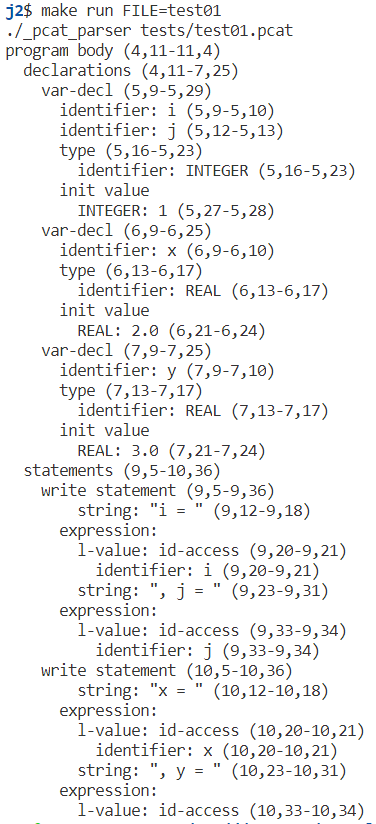

### 包含语法错误的情况

1. `test19.pcat`中第10行的`WHILE`语句结束位置缺了一个分号，对此文件进行语法分析，程序运行结果如下图所示：

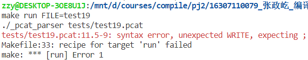

2. PCAT指南中要求，变量声明必须带有初始值，这里把`test01.pcat`中第5行的声明的初始值去掉，程序运行结果如下图所示：

   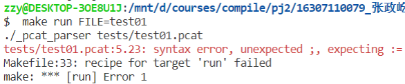

3. 将`test01.pcat`中第5行的声明的初始值改为`11111111111111111111`，这个值超过了PCAT允许的整数的范围，会导致整数溢出错误，程序运行结果如下图所示：

   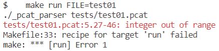

4. 将`test01.pcat`中第9行的字符串的后一个引号去掉，产生“未结束的字符串”的错误：

   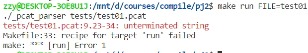

5. 将`test01.pcat`中第3行的`*)`去掉，产生“未结束的注释”的错误：

   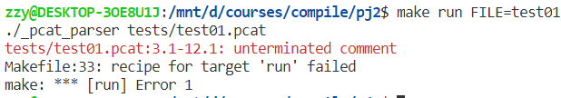
   
6. 将`test16.pact`中第24行的`IF`语句的条件改为`I <= 0 <= J`，由于PCAT中比较运算符不能连续使用，所以会报错：

   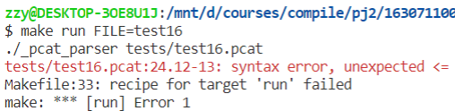

   不过如果把`IF`的条件改为`(I <= 0) <= J`则是符合语法要求的，会正常生成语法树：

   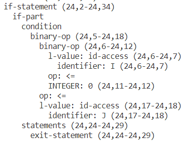

   